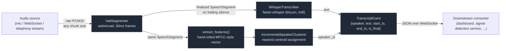

# Real-Time Streaming ASR + Diarization Pipeline

A from-scratch, dependency-light pipeline that takes a continuous stream of
raw audio and turns it into timestamped, speaker-attributed transcript
events in real time: **voice-activity-gated chunking -> streaming
speech-to-text (faster-whisper) -> lightweight speaker diarization ->
WebSocket event stream**.

This repo exists to teach the *architecture* of a real-time ASR pipeline --
why each stage exists, what it actually costs, and where the honest
limitations are -- not just to wire a few libraries together. Every design
decision below has a documented reason and, where relevant, a documented
alternative (see `docs/adr/`).

## Why this design (and what it deliberately doesn't do)

Whisper (and `faster-whisper`, the engine this repo uses) is a **batch**
model: it transcribes a fixed chunk of audio in one forward pass. It has no
native concept of "keep listening and update your guess token by token"
the way a purpose-built streaming ASR model does. So "streaming" here means
**segment-level** streaming -- you get a transcript shortly after each
utterance ends, not a live-updating word-by-word caption while someone is
still mid-sentence. That's a real, load-bearing limitation, not an
oversight -- see "Limitations & extension points" below and
`docs/adr/0002-vad-gated-chunking.md`.

The diarizer (who's speaking) is similarly a deliberate tutorial-grade
simplification: a hand-rolled spectral fingerprint clustered per segment,
not a pretrained neural speaker-embedding model. It cannot resolve two
people talking over each other inside one segment. See
`docs/adr/0003-tutorial-diarizer.md` for exactly why, and the one-function
swap point to upgrade it.

## Architecture



**The event contract** (`api/events.py`) every finalized segment produces:

```json
{"speaker": "speaker_0", "text": "let me pull that up for you", "start_ts": 12.42, "end_ts": 14.1, "is_final": true}
```

`start_ts`/`end_ts` are seconds relative to the start of the connection, not
wall-clock time, so a client can align them without a shared clock with the
server. `is_final` is always `true` in this implementation (see below for
why the field exists anyway) -- this exact shape is designed to be
consumable by a downstream real-time signal/intent-detection service without
any translation layer.

## What's in this repo

| Path | What it does |
|---|---|
| `asr/streaming.py` | `VadSegmenter` (webrtcvad-gated chunk buffering + finalization) and `WhisperTranscriber` (thin faster-whisper wrapper) |
| `diarization/simple_diarizer.py` | Hand-rolled MFCC-style feature extraction + offline (`AgglomerativeClustering`) and incremental (nearest-centroid) speaker clustering |
| `api/pipeline.py` | `ConnectionPipeline` -- wires segmentation + ASR + diarization into one per-connection object, testable without any networking |
| `api/ws_server.py` | FastAPI WebSocket server: binary PCM in, JSON `TranscriptEvent`s out |
| `scripts/synthesize_test_audio.py` | Generates synthetic, non-copyrighted "speech-like" WAV fixtures for tests/demo (see honesty note below) |
| `scripts/stream_wav_file.py` | CLI: stream a real WAV file to the server at real-time pace, or run the pipeline locally with `--offline` |
| `tests/` | Fast pytest suite (mocked ASR, real VAD/diarization/pipeline logic) + `tests/live/` (real faster-whisper model, excluded by default) |
| `docs/adr/` | Three ADRs explaining the faster-whisper, VAD-chunking, and diarizer design decisions |
| `docs/PRODUCTION.md` | Latency budget, scaling to concurrent calls, upgrading the diarizer, telephony ingestion, consent/retention/PII |

## Setup & run

Requires Python 3.10+ (built and tested here on 3.10; `webrtcvad-wheels` is
used instead of plain `webrtcvad` on Windows, where the latter has no
prebuilt wheel -- see `requirements.txt`).

```bash
python -m venv .venv
source .venv/bin/activate   # .venv\Scripts\activate on Windows
pip install -r requirements.txt

# Generate the synthetic test fixture (also regenerable any time)
python -m scripts.synthesize_test_audio

# Fast test suite -- mocked ASR, real VAD + diarization + pipeline logic, ~3s
pytest

# Slow/real test -- actually downloads and runs faster-whisper tiny.en
pytest -m live tests/live/
```

Run the server and stream the synthetic fixture to it:

```bash
uvicorn api.ws_server:app --reload &
python -m scripts.stream_wav_file --wav tests/fixtures/two_speaker_conversation.wav
```

Or skip the network entirely and run the pipeline in-process:

```bash
python -m scripts.stream_wav_file --wav tests/fixtures/two_speaker_conversation.wav --offline
```

**To try it with real speech**, supply your own 16kHz mono 16-bit WAV file
(convert anything else with
`ffmpeg -i input.mp3 -ar 16000 -ac 1 -sample_fmt s16 output.wav`) and point
either command above at it instead of the synthetic fixture.

Run with Docker:

```bash
docker build -t asr-diarization-pipeline .
docker run -p 8000:8000 asr-diarization-pipeline
```

## What was actually measured (not simulated)

Everything below was run in the sandbox this repo was built in (Windows,
CPU-only, Python 3.10, `faster-whisper` `tiny.en`/int8) -- see
`docs/PRODUCTION.md` for how these numbers translate into a latency budget.

- **VAD segmentation, on the real synthetic fixture** (`tests/fixtures/two_speaker_conversation.wav`,
  8.3s total, speaker-A/B/A/B pattern with 700ms silence gaps): `VadSegmenter`
  correctly produced **4 segments** at the expected boundaries
  (`0.69-2.49`, `2.58-4.41`, `4.50-6.30`, `6.39-8.19`), fed in
  non-frame-aligned 3200-byte chunks to exercise the real buffering logic,
  not idealized frame-sized input.
- **Diarization, on those same 4 real segments**: extracted features'
  pairwise Euclidean distances were **~0.6-1.0 between the two same-speaker
  pairs** and **~9.4-9.6 between different-speaker pairs** -- a clean
  separation that's what the shipped default (`distance_threshold=5.0` /
  `new_speaker_distance=5.0`) is calibrated against. Both the offline
  (`AgglomerativeClustering`) and incremental (nearest-centroid) clusterers
  correctly grouped segments 0&2 as one speaker and 1&3 as the other.
- **The real faster-whisper model, end to end** (`--offline` mode against
  the synthetic fixture): model load took **~5.1s**; transcribing the full
  8.3s fixture took **~2.0s** of inference time, i.e. roughly **0.24x
  real-time** (processing time was about a quarter of the audio's
  duration) on ordinary CPU hardware, no GPU. Honest caveat: the synthetic
  fixture is tone bursts, not real speech (see below), so most segments
  transcribed to empty output and got filtered by the pipeline (by design
  -- empty transcripts aren't emitted as events); the two segments that did
  produce non-empty text were correctly re-identified by the diarizer as
  the same recurring synthetic voice.
- **Test suite**: 16 tests pass in ~3s (`pytest`, mocked ASR); 1 additional
  test in `tests/live/` (excluded by default) exercises the real model.

## Honesty note: the synthetic audio fixture is not real speech

`scripts/synthesize_test_audio.py` generates amplitude-modulated,
harmonically-structured tone bursts -- loud and speech-band enough to
reliably trigger `webrtcvad`, with two distinct spectral profiles so the
diarizer has something structurally different to cluster -- specifically so
this repo ships **zero copyrighted or third-party speech audio** while still
letting CI and a fresh clone exercise the real chunking, VAD, diarization,
and event-contract logic end to end. It is not a substitute for evaluating
transcription accuracy, which requires real speech with a known ground-truth
transcript. Supply your own real audio (see "Setup & run" above) to actually
evaluate transcription quality.

## Limitations & extension points

- **Segment-level, not token-level, streaming.** No partial/interim
  hypotheses while someone is still talking -- a genuinely incremental ASR
  engine is the extension point (`docs/adr/0002`); the `is_final` field in
  the event contract already exists for exactly this future upgrade path.
- **Diarization can't resolve overlapping speech**, and its default
  distance threshold was calibrated against one synthetic fixture, not a
  labeled real-speech dataset (`docs/adr/0003`).
- **One shared model instance per process** (`api/ws_server.py`) -- fine for
  a handful of concurrent connections on CPU, a real concurrency bottleneck
  under production call volume. See `docs/PRODUCTION.md` for the worker-pool
  / batched-GPU-inference architecture that fixes this.
- **No persistence.** This service streams events and keeps no state after a
  connection closes -- any production deployment that adds recording/
  transcript storage needs to layer in its own retention and access-control
  policy (see `docs/PRODUCTION.md`, section 5).

For the telephony-ingestion path (SIP/RTP, media-streaming webhooks),
scaling to concurrent calls, GPU batching, upgrading the diarizer to
`pyannote.audio`, and consent/PII considerations, see **[docs/PRODUCTION.md](docs/PRODUCTION.md)**.
For the reasoning behind the three core design decisions, see
**[docs/adr/](docs/adr/)**.

## Compatibility note

This pipeline's WebSocket event shape (`{speaker, text, start_ts, end_ts,
is_final}`) is designed to be consumed directly by a downstream real-time
conversational-signal-detection service -- i.e., this repo's output is
meant to be someone else's input, not a dead end. No specific downstream
service is required to use this repo on its own.

## License

MIT -- see [LICENSE](./LICENSE).

---


### Thank you for reading

#### Please consider giving a star if you find the repo useful. Thank you.

---

### **AUTHOR'S BACKGROUND**
### Author's Name:  Emmanuel Oyekanlu
```
Skillset:   I have experience spanning several years in data science, enterprise AI architecture and solutions, developing scalable enterprise data pipelines,
enterprise solution architecture, architecting enterprise systems data and AI applications,
software and AI solution design and deployments, data engineering, industrial intelligent vision systems, high performance computing (GPU, CUDA), machine learning,
NLP, Agentic-AI and LLM applications as well as deploying scalable solutions (apps) on-prem and in the cloud.

I can be reached through: manuelbomi@yahoo.com

Publications:  https://scholar.google.com/citations?user=S-jTMfkAAAAJ&hl=en
LinkedIn:  https://www.linkedin.com/in/emmanuel-oyekanlu-6ba98616
Github:  https://github.com/manuelbomi

```
[](https://skillicons.dev)
